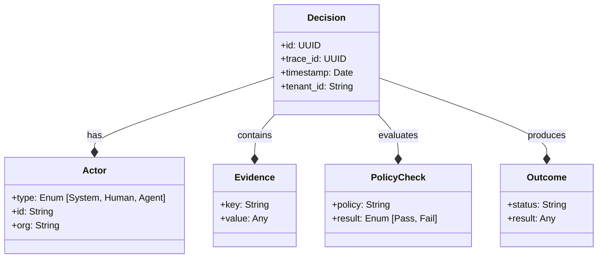
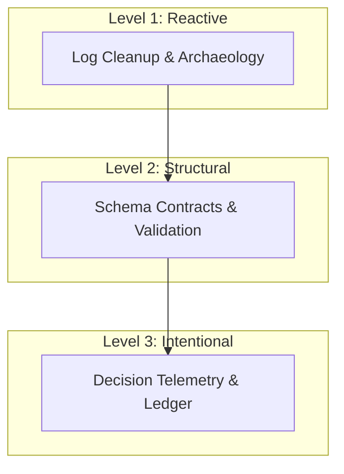
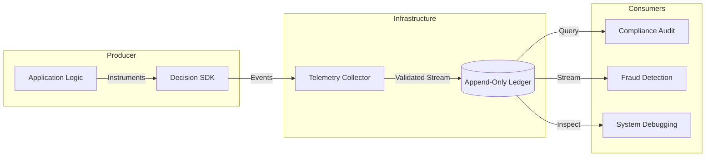

# Decision Telemetry Architecture
## A Universal Contract for Analytics-Ready Systems

**Author:** <Your Name>  
**Version:** 0.2  
**Date:** <Date>

---

## Executive Summary

Modern analytics teams spend enormous effort reconstructing decisions from logs, events, and scattered artifacts. This reactive model turns analytics into archaeology: pipelines compensate for upstream ambiguity, investigations rely on reverse engineering, and explainability becomes expensive.

This paper argues that analytics maturity requires a structural shift. Decisions must be emitted as first-class semantic objects at runtime rather than inferred after the fact. We introduce decision contracts — a standardized representation of outcomes, evidence, and lineage — and describe an architecture pattern that makes analytics-ready systems intentional by design.

Decision telemetry does not replace existing observability or data contracts. It adds a semantic layer that allows analytics systems to consume declared intent instead of reconstructing behavior. The result is faster investigations, clearer audit trails, and predictable analytics pipelines.

This paper presents a maturity model, architectural framework, and reference implementation demonstrating how decision contracts can function as a universal standard for analytics-driven systems.


## Abstract

Modern analytics systems operate in a fundamentally reactive mode: they reconstruct decisions after the fact from logs, events, and partial artifacts. This creates fragile pipelines, high investigation cost, and limited explainability in domains such as fraud detection, compliance, and AI-driven systems. While data contracts have improved structural stability, they address schema integrity rather than semantic intent. This paper argues that decisions themselves must become first-class architectural objects.

We introduce the concept of *decision contracts*: a standardized runtime representation of outcomes, evidence, and lineage that is emitted at the moment a decision occurs. Decision contracts allow analytics systems to consume intent directly rather than infer it indirectly. We propose a three-stage analytics maturity model — reactive cleanup, structural contracts, and intentional decision instrumentation — and describe an architecture pattern intended to enable analytics-ready systems by design. A reference implementation demonstrates the practicality of this approach and suggests a path toward a universal decision telemetry standard.

---

## 1. The hidden tax of reactive analytics

Most analytics systems today operate in a reactive mode. Producer systems emit logs, events, and state changes without an explicit representation of intent. Analytics teams then reconstruct decisions by correlating artifacts across multiple sources. Fraud investigations, operational debugging, and compliance analysis often require reverse-engineering why a system behaved the way it did.

This pattern treats analytics as a downstream cleanup function. Pipelines become infrastructure dedicated to interpretation rather than insight. Engineers maintain fragile transformations that depend on implicit assumptions about upstream behavior. When upstream systems change, analytics silently degrades or requires costly rework. The organization accumulates what can be described as a semantic debt: intent exists in code, but not in data.

This reactive model does not fail because of insufficient tooling. It fails because producer systems are not designed to emit decision semantics. Logs capture behavior; metrics capture aggregates; events capture transitions. None of these primitives guarantee an explicit statement of why a decision occurred.

As systems grow more automated and AI-driven, this gap widens. The cost of reconstructing decisions increases faster than the value of analytics derived from them. A structural shift is required: decisions must be observable by design, not inferred after the fact.

## 1.1 The Urgency of Now

Three converging trends have dramatically increased the cost of opaque decision systems, transforming this from a technical debt issue into a strategic risk:

1.  **AI and Probabilistic Systems**: Unlike deterministic code, AI agents and LLMs produce probabilistic outputs. Understanding *why* an agent took an action cannot be solved by reading the code; it requires a trace of the context, prompt, and model output.
2.  **Automated Fraud Pipelines**: Modern fraud detection is a complex DAG of rules, ML models, and manual reviews. When a legitimate user is blocked, "debugging" the decision requires tracing a path through dozens of independent components.
3.  **Regulatory Pressure**: New frameworks (EU AI Act, GDPR, financial compliance) demand more than just logs; they require explainability. Organizations must be able to mechanically prove why a specific decision was made, without relying on forensic archaeology.

---

## 2. Limits of structural data contracts

The introduction of data contracts represents an important maturity step for analytics systems. By establishing explicit schema guarantees, organizations reduce accidental breakage and improve producer accountability. Structural contracts create predictability in data pipelines and prevent downstream failures caused by undocumented changes.

However, structural stability is not equivalent to semantic clarity.

A data contract answers the question:

> What fields exist?

It does not answer:

> What decision happened and why?

Even perfectly stable schemas can encode ambiguous intent. Logs may be well-structured yet still require interpretation. Metrics may be consistent yet detached from the reasoning that produced them. Events may capture transitions without declaring the decision logic that drove those transitions.

Contracts prevent damage; they do not add meaning.

This distinction is critical. Structural contracts stabilize pipelines, but they do not eliminate the need for downstream inference. Analytics teams still reconstruct intent indirectly, using domain knowledge and heuristics. The system becomes safer, but not more explainable.

The next stage of maturity requires contracts that express semantics, not only structure.

---

## 3. Decisions as first-class objects

All software systems that interact with the real world are decision systems. They classify, approve, reject, route, score, escalate, and prioritize. These decisions already exist as executable logic, but they rarely exist as explicit data objects.

A decision can be defined as a comprehensive semantic object composed of five core elements:

**Decision = Context + Actor + Logic + Outcome + Lineage**

1.  **Context**: The environmental state (Timestamp, System Version, Environment).
2.  **Actor**: The entity responsible for the decision (System, AI Agent, or Human).
3.  **Logic**: The evidence used and policies evaluated (Rules, Model Scores, Checks).
4.  **Outcome**: The final result (Approved, Rejected, Flagged).
5.  **Lineage**: The causal chain of preceding decisions (Parent/Child relationships).




When these elements are emitted intentionally at runtime, the system declares its reasoning rather than forcing analytics to infer it.

A *decision contract* is the standardized representation of this object. It is not a logging convention. It is a semantic declaration that a meaningful decision has occurred, recorded in an append-only ledger.

This shift transforms decisions from implicit side effects into explicit artifacts. Analytics systems no longer reverse engineer intent; they consume it directly. Investigations become queries against declared reasoning rather than forensic reconstruction.

## 3.1 Anatomy of a Decision Event

To make this concrete, a decision is not a single log line but a structured event containing specific fields. The schema is language-agnostic and transport-neutral. Below is a JSON representation of a decision outcome event as defined in the reference implementation:

```json
{
  "event_type": "decision.outcome",
  "decision_id": "dec_01HQK4K...",
  "trace_id": "trc_01HQK4L...",
  "timestamp": "2026-02-09T14:30:00Z",
  "actor": {
    "type": "system",
    "id": "risk_engine_v2"
  },
  "payload": {
    "status": "approved",
    "risk_score": 0.05
  },
  "causal_links": [
    {
      "type": "triggered_by",
      "target_decision_id": "dec_PREV..."
    }
  ]
}
```

This strict schema ensures that every decision - whether from a microservice, a monolith, or an AI agent - looks identical to the analytics layer.

## 3.2 Safety and Privacy by Design

A critical requirement for decision telemetry is safety. Recording decisions must never compromise the system's stability or the user's privacy.

### PII Redaction
Decision payloads often contain sensitive data (names, emails, tokens). The telemetry layer must support automatic redaction of Personally Identifiable Information (PII) at the source, before the event leaves the producer system.

### Failure Isolation
Telemetry is a non-critical path. If the decision recording infrastructure fails (e.g., the collector is down), the application must continue to function normally. The SDK isolates telemetry errors, ensuring that observability issues never cause business logic failures.

### Immutability
Once a decision is recorded, it is written to an append-only ledger. This guarantees that the history of reasoning cannot be altered, providing a reliable audit trail for compliance and governance.

## 4. Analytics maturity model

Analytics architecture evolves through recognizable stages of maturity. These stages are not mutually exclusive; they represent an accumulation of capabilities.




### Level 1 — Reactive cleanup

At this stage, analytics reconstructs decisions from artifacts. Pipelines compensate for inconsistent upstream emissions. Knowledge of system behavior is embedded in transformation logic and institutional memory. Analytics functions as archaeology.

### Level 2 — Structural contracts

Here, organizations introduce schema guarantees and producer accountability. Pipelines become stable. Breakage decreases. However, intent remains implicit. Analytics consumes structured artifacts but still performs semantic inference.

### Level 3 — Intentional decision telemetry

In the final stage, decisions are emitted as structured semantic objects. Producers instrument decision contracts directly. Analytics consumes declared intent rather than reconstructing it. Explainability, auditability, and investigation speed improve as a consequence of architecture, not heroics.

This model does not replace earlier stages. Structural contracts remain essential. Decision telemetry builds on that foundation by adding meaning to structure.

---

## 5. Decision Telemetry architecture pattern

Decision Telemetry Architecture introduces a dedicated semantic layer between producer systems and analytics consumers.

1.  **Producer Systems**: Application code instruments decision points using an SDK. At the moment a decision occurs, it emits a structured event (Start, Evidence, Policy Check, Outcome).
2.  **Collector**: A lightweight agent receives these events, validates them against the schema, and buffers them for efficient transmission.
3.  **Decision Ledger**: The core of the architecture is the **Append-Only Ledger**. Unlike mutable databases, the ledger stores the immutable history of decisions. The ledger is a logical architectural concept, not a specific storage technology. It guarantees that reasoning can be audited exactly as it happened.
4.  **Analytics Consumers**: Downstream systems (Fraud Detections, Compliance Audits, AI Governance) consume from the ledger. They query declared intent rather than inferring behavior from logs.




This architecture resembles the evolution of observability systems. Metrics and traces did not replace logs; they added a higher-level abstraction that made system behavior legible. Decision telemetry performs the same function for *intent*.

The pattern is incremental. Systems can instrument high-value decision points first, expanding coverage over time. Adoption does not require rewriting existing architecture; it requires declaring semantics where they already exist.

---

## 6. Practical implications

The practical impact of decision telemetry is most visible in domains where explainability is essential.

### Fraud systems

Fraud investigations often reconstruct rule chains and model reasoning from scattered artifacts. Decision contracts collapse this process into a single semantic object. Investigation time decreases, and rule tuning becomes data-driven rather than inferential.

### AI governance

AI-driven systems face increasing demands for explainability. Decision telemetry provides a structured audit trail of reasoning inputs and outputs. Governance shifts from post-hoc interpretation to runtime transparency.

### Compliance and audit

Regulatory environments require reproducible explanations. Decision contracts encode reasoning as data, enabling mechanical audit rather than manual reconstruction.

### Debugging distributed systems

Complex systems fail through cascades of decisions. Lineage-aware decision telemetry reveals causal chains that logs alone obscure.

In each case, the benefit is not new analytics capability. It is the removal of interpretive friction.

---

## 7. Reference implementation

The Decision Trace SDK provides a reference implementation of decision telemetry concepts. It demonstrates that decision contracts can be emitted with minimal overhead and integrated incrementally into existing systems.

The implementation is not the architecture. It is evidence that the architecture is practical.

Multiple implementations could exist. The value lies in the contract, not the tool.

---

## 8. Related Work

Decision telemetry does not exist in a vacuum. It builds upon and extends several established disciplines:

-   **Structured Logging**: Provides the format (JSON) but lacks the semantic schema for decisions. Logs tell you *what* happened, not *why*.
-   **OpenTelemetry (OTel)**: Solves the distributed context propagation problem (traces/spans) but focuses on *latency* and *errors*. Decision telemetry leverages OTel's context propagation but adds a semantic layer for *business logic*.
-   **Data Contracts**: Enforce schema stability for analytics but often miss the diverse runtime context of a decision. Decision contracts are a specialized form of data contract focused on reasoning.
-   **Event Sourcing**: Records state changes. Decisions are often the *cause* of state changes. Recording the decision (the "why") complements the event (the "what").
-   **Audit Trails**: Traditionally separate, manual, and partial. Decision telemetry makes audit trails a natural byproduct of the system's operation.
-   **Explainable AI (XAI)**: Focuses on model weights and features. Decision telemetry captures the *system* context around the model, including policy overrides and human-in-the-loop actions.

**Synthesis**: Decision telemetry extends these inputs by treating decisions as **semantic contracts**. It bridges the gap between low-level infrastructure observability (OTel) and high-level business analytics (Data Contracts).

---

## 9. Toward a universal standard

For decision telemetry to reach its full potential, decision contracts are designed to function as a shared vocabulary. A universal schema allows interoperability across systems, organizations, and industries.

The path forward resembles earlier infrastructure standards: open specification, reference implementations, and community-driven evolution. As adoption grows, decision telemetry can serve as a fundamental layer, similar to metrics and tracing in modern systems.

Standardization does not constrain innovation. It creates a stable semantic layer on which innovation compounds.

---

## Conclusion

Modern analytics spends enormous effort reconstructing intent from artifacts. This is not an inevitability of distributed systems. It is a consequence of architecture that ignores decisions as first-class objects.

Decision telemetry proposes a simple shift: emit reasoning at the moment it occurs.

When decisions are declared explicitly, analytics stops being archaeology. It becomes architecture.

And architecture scales.

---

## 10. References

1.  **OpenTelemetry Project**, "OpenTelemetry Specification," v1.38.0, 2024. [https://opentelemetry.io/docs/specs/otel/](https://opentelemetry.io/docs/specs/otel/).
2.  **Chad Sanderson, Mark Freeman, and B. E. Schmidt**, "Data Contracts: Developing Production-Grade Pipelines at Scale," O'Reilly Media, 2025.
3.  **The European Union**, "Regulation (EU) 2024/1689 laying down harmonised rules on artificial intelligence," Official Journal of the European Union, L, 2024/1689, 12.7.2024. [http://data.europa.eu/eli/reg/2024/1689/oj](http://data.europa.eu/eli/reg/2024/1689/oj).
4.  **Betsy Beyer et al.**, "Site Reliability Engineering: How Google Runs Production Systems," O'Reilly Media, 2016. (See Chapter 4: Service Level Objectives).
5.  **Open Policy Agent**, "Policy-based control for cloud native environments," [https://www.openpolicyagent.org/](https://www.openpolicyagent.org/).
